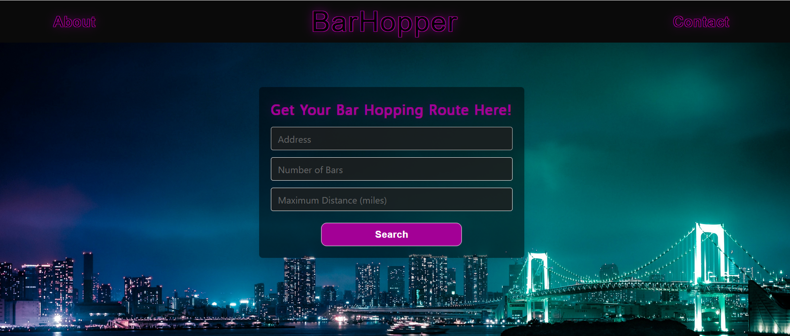

# Bar-Hopper

## A Bar Hopping App

Bar Hopper is here to help any bar hopper plan a night out. Whether it be an unfamiliar city, or you just don't feel like thinking about it, Bar Hopper will help you identify bars, create a route, and take you back to your home (or hotel).

The app requires three inputs: Address (place of lodging); number of bars you desire to visit; and distance willing to walk (miles).

Bar Hopper will then present the user with three starting points furthest from their place of lodging. When the user selects an interesting starting point, Bar Hopper generates a list of bars and a route from the starting bar all the way back to the user's place of lodging. This way the user can enjoy a fun night out and safely end up right back at home!

This app utilizes the Yelp, Geoapify, and Leaflet APIs for finding bar locations, routing, and mapping. The frontend utilizes Flexboxgrid framework for element formatting.

## There is a CORS issue with the Yelp API. The user must first go to https://cors-anywhere.herokuapp.com/corsdemo and click "Request temporary access to the demo server" in order for the API to work correctly.

## Live Site

https://da-mike.github.io/Bar-Hopper/

## Mock Up

The following image shows the web application's appearance and functionality:

## License

No license.